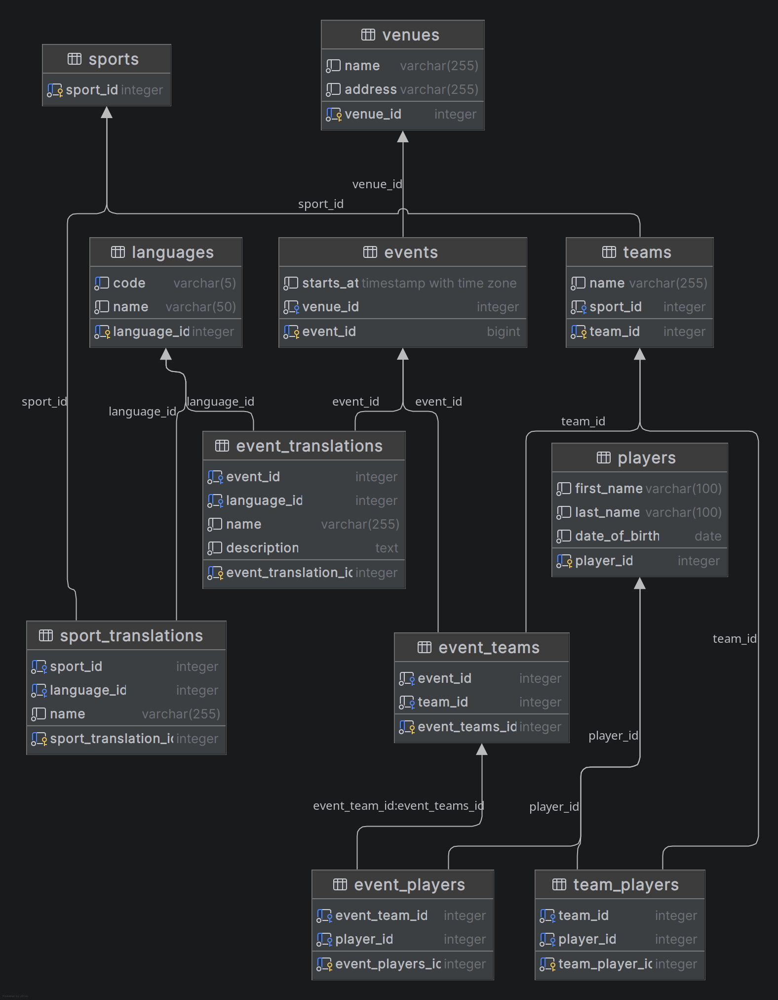

# 🏟️ Sport Events API


[](https://github.com/Medovyha/sport_events_API/actions/workflows/ci.yaml)

Spring Boot API for managing sports events, teams, players, venues, and translations in `en`, `pl`, `uk`.

## ✨ Features

- Full CRUD for sports, teams, players, venues, events
- Event/team/player assignment flows
- Multilingual reads using `Accept-Language`
- Translation update flows for sports and events
- Demo frontend under [src/main/resources/static](src/main/resources/static)
- Docker Compose setup with PostgreSQL

## 🧰 Tech Stack

- Java 21
- Spring Boot 4
- Spring Data JPA / Hibernate
- PostgreSQL 17
- Maven
- Docker / Docker Compose

## 🔄 CI Pipeline

This project has GitHub Actions workflow [ci.yaml](.github/workflows/ci.yaml) with two jobs:

1. **Build and Test**
   - Runs on Ubuntu
   - Uses JDK 21 (Temurin) with Maven cache
   - Executes:
     - `./mvnw -B clean test jacoco:report`
     - `./mvnw -B package -DskipTests`
   - Publishes:
     - JUnit test report (via `dorny/test-reporter`)
     - artifacts: `surefire-reports`, `jacoco-html-report`
   - Computes line/branch coverage from JaCoCo CSV
   - On pull requests: comments coverage summary directly on PR

2. **Docker Build Validation**
   - Runs after tests pass
   - Validates image build with `docker build -t sport-events-api:ci .`

### Trigger rules

- `push` to: `main`, `structure/**`, `feature/**`, `bugfix/**`
- `pull_request` to: `main`

## 🚀 Run

### Docker

```bash
docker compose up --build
```

API and UI: http://localhost:8080

### Local

```bash
./mvnw spring-boot:run
```

## 🌍 Language behavior

Supported languages:

- `en` (default)
- `pl`
- `uk`

Use header:

```http
Accept-Language: pl
```

If translation is missing, API falls back to English.

## 🧱 Database files: schema.sql and data.sql

- [src/main/resources/db/schema.sql](src/main/resources/db/schema.sql)
  - Defines full PostgreSQL schema (tables, sequences, constraints, FK/unique rules)
  - Mounted in Docker to initialize database structure
- [src/main/resources/db/data.sql](src/main/resources/db/data.sql)
  - This is the seed dataset
  - Contains initial languages/sports/teams/players/events/translations


## 🏛️ Why Onion Architecture here

Project follows onion style layers:

- `domain` (core business models/rules)
- `application` (use cases, commands/queries/results)
- `infrastructure` (JPA entities/repositories/adapters)
- `presentation` (REST controllers, request/response DTOs)

Why this helps:

- Domain logic is isolated from Spring/JPA details
- Easier unit testing of use cases without DB
- Lower coupling when changing persistence or API shape
- Clear boundaries for feature growth (e.g., translations, event relations)

Tradeoff:

- More classes/boilerplate and mapping code than a simple CRUD design

## ✅ Pros of multi-language support

Supporting multiple languages gives strong product and business benefits:

- Better user experience for non-English users
- Higher accessibility and adoption across regions
- Easier market expansion without changing core domain logic
- Consistent API contract using `Accept-Language`
- Clean fallback behavior to English when translation is missing
- Reusable translation model for more entities in the future
- Better content quality management through explicit translation updates

## 🔐 Environment variables

Main runtime vars:

- `SPRING_DATASOURCE_URL`
- `POSTGRES_USER`
- `POSTGRES_PASSWORD`
- `POSTGRES_DB`
- `POSTGRES_HOST`
- `POSTGRES_PORT`

Defined/used in:

- [compose.yaml](compose.yaml)
- [src/main/resources/application.properties](src/main/resources/application.properties)

Example `.env` file for Docker Compose:

```env
SPRING_DATASOURCE_URL=jdbc:postgresql://postgres:5432/sportradar
POSTGRES_USER=user
POSTGRES_PASSWORD=password
POSTGRES_DB=sportradar
POSTGRES_HOST=postgres
POSTGRES_PORT=5432
```

## 🗺️ ERD





## 🧪 Tests

```bash
./mvnw test
```

## 📌 Notes

- Hard refresh browser if static assets are cached
- Rebuild containers after backend changes:

```bash
docker compose up --build
```
